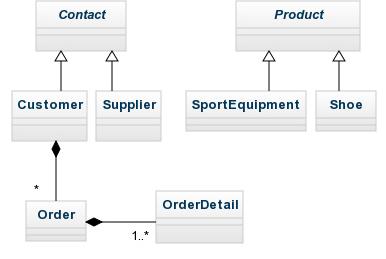

## Tutorial: EBusiness Web Application Simulation

We're gonging to implement an EBusiness(EBiz) web application simulation using XData. The finished code can be found [here](https://github.com/knat/XData/tree/master/Examples/EBiz).

There are eight main types in EBiz:



`Contact` and `Product` are abstract, others are concrete. A `Customer` may contain zero or more `Order`s, an `Order` must contain one or more `OrderDetail`s.

There are two C# projects in EBiz: `Service` and `Client`. `Service` is a class library, it provides class `WebApiSimulation` to `Client`:

```C#
public static class WebApiSimulation {
    public static string GetContacts() {
        //save contacts to Contacts.txt...
        return "Contacts.txt";
    }
    public static string GetProducts() {
        //save products to Products.txt...
        return "Products.txt";
    }
}
```

`Client` is a console application, it will load contacts and products from Contacts.txt and Products.txt, and dump them to the console.

Below is the content of Products.txt:

```
a0:Products <a0 = @"http://example.com/webapi" a1 = @"http://example.com/ebiz"> = 
    {
        Product = (a1:SportEquipment)
            [
                Id = 1
                Name = @"Mountain bike"
                StockQuantity = 10
                Applicability = @"adults only!"
            ]
            {
                Price = 
                    [
                        Kind = @"CNY"
                    ]
                    $ 3998
                Image = 
                    [
                        Mime = @"image/jpeg"
                    ]
                    $ "AQIDBAU="
            }
        Product = (a1:SportEquipment)
            [
                Id = 2
                Name = @"Road bike"
                StockQuantity = 5
                Applicability = @"adults only!"
            ]
            {
                Price = 
                    [
                        Kind = @"CNY"
                    ]
                    $ 5700
                Image = 
                    [
                        Mime = @"image/jpeg"
                    ]
                    $ "AgMEBQY="
            }
        Product = (a1:Shoe)
            [
                Id = 3
                Name = @"Outdoor shoe"
                StockQuantity = 99
                Gender = @"Man"
            ]
            {
                Price = 
                    [
                        Kind = @"CNY"
                    ]
                    $ 250
                Image = 
                    [
                        Mime = @"image/png"
                    ]
                    $ "AwQFBgc="
                Size = 
                    [
                        Unit = @"CM"
                    ]
                    $ 26.5
            }
    }
```

Yes, yet another data exchange format! Below is the explanation of the XData data format:

```
//single line comment
/*delimited comment*/
alias1:RootElement <alias1 = "http://example.com" alias2 = "http://foo.com"> =
    (alias1:RootElementType) //optional type indicator indicating the type name of a value
    [ //attributes
        Attribute1 = (sys:Double)-42.42 //reserved alias "sys" referencing the system URI "http://xdata-io.org" 
        Attribute2 = #[2 3 5 7 11] //list value
        Attribute3 = "tank@example.com" //atom value
    ]
    { //complex children
        ChildElement1 = //elements may be URI qualified, attributes always unqualified
            [
                Attribute1 = (sys:DateTimeOffset)"2015-02-24T11:55:03+00:00"
                AttributeWithoutValue
            ]
            $ "AAECAw==" //simple child
        alias2:ElementWithoutValue
        alias1:Element1 <alias1 = "http://bar.com"> = //aliases can be redefined
            {
                alias1:Element2 = $ 42
                Element3 = true
            }
    }
```

Value categories: 

```
value
  |-simple value
  |  |-atom value //e.g: "normal string" @"verbatim string" -42 -42.42 -42.42E7 true false
  |  |-list value //item must be simple value. e.g: #[42 #["str" 42.42] #[] true]
  |-complex value //may have attributes: [ attributes ]
     |-simple child complex value // [ attributes ] $ simple-value-child
     |-complex children complex value // [ attributes ] { child-elements }
```

An attribute is a name-value pair, the value must be simple or have no value. An element is a name-value pair, the value can be simple or complex or have no value.

XData is a static typing solution. Type information is defined in the XData schema. However, every value must be associated with a concrete type. For example, because `Product` is a abstract type, type indicator(`(a1:SportEquipment)`, `(a1:Shoe)`) is required to associate the value with a concrete type(`SportEquipment`, `Shoe`). In most cases, type indicators are not required.

Schema is the specification/contract of the data. Below is the snippet of the EBiz schema:

```
//EBiz.xds

namespace "http://example.com/common"
{
    type String10 restricts sys:String
    ${
        lengthrange 1..10 //1 <= char count <= 10
    }
    
    type NonNegativeInt32 restricts sys:Int32
    ${
        valuerange [0..
    }
    
    type PositiveInt32 restricts NonNegativeInt32
    ${
        valuerange (0..
    }

    type PositiveInt32List lists PositiveInt32

    type Email restricts String
    ${
        lengthrange ..40
        pattern @"[a-zA-Z0-9._%+-]+@[a-zA-Z0-9.-]+\.[a-zA-Z]{2,4}"
    }

    type Phone
    [
        Kind as PhoneKind
    ]
        $ String20

    type PhoneKind restricts String
    ${
        enum
            "Unknown" as Unknown
            "Work" as Work
            "Home" as Home
    }

    type NormalAddress
    [
        Country as String20
        State<?> as String20
        City as String20
        Address as String40
        ZipCode as String10
    ]

    type SpatialAddress
    [
        Longitude as SpatialNumber
        Latitude as SpatialNumber
    ]

    type SpatialNumber restricts Decimal
    ${
        precision 8
        scale 5
    }
}

namespace "http://example.com/ebiz"
{
    import "http://example.com/common" as com

    type Contact<abstract>
    [
        Id as com:PositiveInt32
        Name as com:String10
        Email as Email
        RegDate as DateTimeOffset
    ]
    #{
        Phone<1..5 membername PhoneList> as Phone
        ?{
            NormalAddress as NormalAddress
            SpatialAddress as SpatialAddress
        }<membername Address>
    }

    type Customer extends Contact
    [
        Reputation as Reputation
    ]
    #{
        Order<* membername OrderList> as Order 
    }

    type Supplier extends Contact
    [
        BankAccount as String40
        ProductIdList<?> as PositiveInt32List
    ]
}

namespace "http://example.com/webapi"
{
    import "http://example.com/ebiz" as ebiz

    type ContactsType
    #{
        Contact<+ membername ContactList> as ebiz:Contact
    }

    element Contacts<nullable> as ContactsType

    type ProductsType
    #{
        Product<+ membername ProductList> as ebiz:Product
    }

    element Products<nullable> as ProductsType
}
```


A namespace is identified by a URI. Namespace members can be types(`type TypeName ...`) or global elements(`element ElementName ...`). If namespace members want to reference other namespace's members, namespace import(`import "http://example.com/common" as com`) is required. You can use qualified names(e.g: `com:PositiveInt32`) or unqualified names(e.g: `PositiveInt32`) to reference the members.

There is a system namespace "http://xdata-io.org", which contains predefined system types. System namespace is implicitly imported into every user namespace. The reserved alias `sys` is used to reference the system namespace(e.g: `sys:Int32`).

Below is the hierarchy of the predefined system types, "<...>" are abstract types, otherwise concrete types:

```
<ComplexType>
<SimpleType>
  |-<ListType> //e.g: #[2 3 5 7 11]
  |-<AtomType>
    |-String
    |-IgnoreCaseString //e.g: "Tank" == "tank"
    |-Decimal //128 bit fixed point number, 28 digit precision
    |  |-Int64 //64 bit signed integer
    |  |  |-Int32
    |  |     |-Int16
    |  |        |-SByte //8 bit signed integer
    |  |-UInt64 //64 bit unsigned integer
    |     |-UInt32
    |        |-UInt16
    |           |-Byte //8 bit unsigned integer
    |-Double //64 bit double precision floating point number, can be "INF", "-INF" and "NaN"
    |  |-Single //32 bit single precision floating point number, can be "INF", "-INF" and "NaN"
    |-Boolean //true or false
    |-Binary //Base64 encoded, e.g: "AAECAw=="
    |-Guid //e.g: "A0E10CD5-BE6C-4DEE-9A5E-F711CD9CB46B"
    |-TimeSpan //e.g: "73.14:08:16.367" 73 days, 14 hours, 8 minutes and 16.367 seconds
    |          // "-00:00:05" negative 5 seconds
    |-DateTimeOffset //e.g: "2015-01-24T15:32:03.367+07:00" "2015-01-01T00:00:00+00:00"
```

A new atom type can be derived by restricting an existing atom type(e.g: `String10`, `NonNegativeInt32`). Facets(restriction rules) are defined in `${ }`:

* `lengthrange`: Specify character count range of `String` and `IgnoreCaseString`, byte count range of `Binary`, item count range of `ListType`. The left side of `..` is min length, the right side is max length.
* `precision`: Specify total digit count of `Decimal`.
* `scale`: Specify fraction digit count of `Decimal`.
* `valuerange`: For `String`, `IgnoreCaseString`, numeric types(from `Decimal` to `Single`), `TimeSpan` and `DateTimeOffset`. The type value must be between the value range. `[` or `]` means inclusion, `(` or `)` means exclusion.
* `enum`: For `String` to `DateTimeOffset`. The type value must equal to one of the enum values.
* `pattern`: For `String` to `DateTimeOffset`. The type value string must match the regular expression.

Another example for `valuerange`:

```
type Year2015 restricts DateTimeOffset
${
    valuerange ["2015-01-01T00:00:00+00:00" .. "2016-01-01T00:00:00+00:00")
}
```

Use `lists` to create a new list type(e.g: `PositiveInt32List`).

Schema is the rules to the data. If a string value is associated with type `String10`, its character count must be between 1 to 10, otherwise the validation will fail.

Type `NormalAddress` is a complex type. Attributes are defined in `[ ]`. Attributes can be annotated as optional using the question mark(e.g: attribute `State`). Attributes must reference simple types.

Type `Phone` is a simple child complex type. A simple child(`$ ...`) must reference a simple type.

Type `Contact` is a complex children complex type. Complex children are defined in `#{ }`. Complex children can be local element(e.g: `Phone`) and/or structures(e.g: `?{...}` is a choice structure). `*`(0..infinite) and `+`(1..infinite) are occurrence marker. A `Contact` must have at least one and at most five child element `Phone`, following is a choice between `NormalAddress` and `SpatialAddress`. Complex types can be extended by adding attributes and/or children. Below is valid data for contacts:

```
Contact = (a1:Customer)
    [
        Id = 2
        Name = @"Mike"
        Email = @"mike@example.com"
        RegDate = "2014-01-14T13:32:38.1206556+00:00"
        Reputation = @"Gold"
    ]
    {
        Phone = 
            [
                Kind = @"Work"
            ]
            $ @"23456789"
        NormalAddress = 
            [
                Country = @"China"
                State = @"Sichuan"
                City = @"Suining"
                Address = @"somewhere"
                ZipCode = @"629000"
            ]
    }
Contact = (a1:Supplier)
    [
        Id = 3
        Name = @"Eric"
        Email = @"eric@example.com"
        RegDate = "2013-08-21T13:32:38.1226557+00:00"
        BankAccount = @"22334455667788"
        ProductIdList = #[1 2 3]
    ]
    {
        Phone = 
            [
                Kind = @"Work"
            ]
            $ @"34567890"
        Phone = 
            [
                Kind = @"Home"
            ]
            $ @"45678901"
        SpatialAddress = 
            [
                Longitude = -113.567
                Latitude = 45.218
            ]
    }
```

`membername` is for code generation. If an attribute/element is annotated as `nullable`(e.g: element `Contacts`), the attribute/element data may have no value.

The XData data object model(DOM) is a class library used to manipulate(create, modify, save, load, validate, etc) data. Currently there is only .NET implementation, but other implementations(Java, C++, etc) are definitely possible and welcomed.

Below is the hierarchy of the DOM classes, "<...>" are abstract classes, otherwise concrete classes. All the classes are defined in namespace `XData`:

```
<XObject>
  |-<XType>
  |  |-<XComplexType>
  |  |-<XSimpleType>
  |     |-<XListType>
  |     |  |-<XListType<T>>
  |     |-<XAtomType>
  |        |-<XStringBase>
  |        |  |-XString
  |        |  |-XIgnoreCaseString
  |        |-XDecimal
  |        |  |-XInt64
  |        |  |  |-XInt32
  |        |  |     |-XInt16
  |        |  |        |-XSByte
  |        |  |-XUInt64
  |        |     |-XUInt32
  |        |        |-XUInt16
  |        |           |-XByte
  |        |-XDouble
  |        |  |-XSingle
  |        |-XBoolean
  |        |-XBinary
  |        |-XGuid
  |        |-XTimeSpan
  |        |-XDateTimeOffset
  |-<XAttribute>
  |-<XAttributeSet>
  |-<XChild>
     |-<XElement>
     |  |-<XEntityElement>
     |  |  |-<XLocalElement>
     |  |  |-<XGlobalElement>
     |  |-<XGlobalElementRef>
     |-<XChildContainer>
        |-<XChildCollection>
        |  |-<XChildSet> 
        |  |-<XChildSequence>
        |-<XChildChoice>
        |-<XChildList>
           |-<XChildList<T>>
```

You cannot directly use the DOM library, because most classes are abstract.

The schema compiler has two duties: first it checks the schema is correct in syntax and in semantics; second it generates the concrete code(currently C# code) from the schema, which is based on the abstract DOM library.

Let's get our hands dirty to finish the EBiz web application simulation.

1) [Visual Studio 2013](http://www.visualstudio.com/downloads/download-visual-studio-vs) is required.

2) Download and install the latest [XData VSIX package](https://github.com/knat/XData/releases).

3) Open EBiz.sln, done. Below are steps if you want to create other projects. Unload and edit the .csproj file, insert the following code at the end of the file:

```xml
<!--Begin XData-->
<Import Project="$([System.IO.Directory]::GetFiles($([System.IO.Path]::Combine($([System.Environment]::GetFolderPath(SpecialFolder.LocalApplicationData)), `Microsoft\VisualStudio\12.0\Extensions`)), `XData.targets`, System.IO.SearchOption.AllDirectories))" />
<!--End XData-->
```


4) Reload the project, add the [XData DOM portable library NuGet package](https://www.nuget.org/packages/XDataDOM) to the project:

```
PM> Install-Package XDataDOM -Pre
```

5) Open "Add New Item" dialog box -> Visual C# Items -> XData -> Create a new XData Schema file.

6) Create a new XData Indicator file. The indicator file indicates the code should be generated in which C# namespaces:

```
namespace "http://example.com/project1" = Example.Project1 //C# namespace
namespace "http://example.com/project2" = Example.Project2
```

7) After (re)build the project, __XDataGenerated.cs will contain the generated code.


