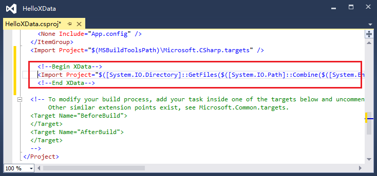

## XData: Schematized Data Exchange Solution

The world needs to exchange data. Data needs to have a specification. Schema is the specification of the data. We the programmers need to program everything. XData is a programming-friendly solution for schematized data. This is the reason XData comes to birth.

[Tutorial: EBusiness Web Application Simulation](https://github.com/knat/XData/blob/master/Docs/TutorialEBiz.md).

XData contains four parts: data, schema, data object model, and code generation.

### Data

The XData data is a text-based tree-like structure. An example:

```
//single line comment
/*delimited comment*/
a0:RootElement <a0 = "http://example.com/project2" a1 = "http://example.com/project1"> = (a0:RootElementType)
    [
        Attribute1 = (sys:Double)-42.42
        Attribute2 = #[2 3 5 7 11]
        Attribute3 = "tank@example.com"
    ]
    {
        ChildElement1 = 
            [
                Attribute1 = "2015-02-24T11:55:03.4678254+00:00"
                Attribute2 = "ffe66c34-0bdf-4653-87d0-0a866275aae7"
            ]
            $ (a1:Binary4to20)"AAECAw=="
        ChildElement1 = 
            [
                Attribute1 = "2015-02-24T04:19:03.4698255+00:00"
                Attribute2
            ]
            $ (a1:Binary4to20)"AQECAw=="
        ChildElement2
        ChildElement3 = 
            {
                ChildChildElement1 = "Red"
                a1:GlobalElement2 = 42
            }
    }
```

#### Lexical Grammar

Lexical grammar defines rules that recognize one or more characters as a token.

```
white-space:
unicode-category-Zs | '\u0009' | '\u000B' | '\u000C'
;
new-line:
'\u000D' | '\u000A' | '\u0085' | '\u2028' | '\u2029'
;
white-space-or-new-line-token:
(white-space | new-line)+
;
single-line-comment-token:
'//' (!new-line)*
;
delimited-comment-token:
'/*' (!'*/')* '*/'
; 
name-token:
normal-name-token | verbatim-name-token
;
verbatim-name-token:
'@' normal-name-token
;
normal-name-token:
name-start-char name-part-char*
;
name-start-char:
letter-char | '_'
;
name-part-char:
letter-char | decimal-digit-char | connecting-char | combining-char | formatting-char
;
letter-char:
unicode-category-Lu-Ll-Lt-Lm-Lo-Nl
;
decimal-digit-char:
unicode-category-Nd
;
connecting-char:
unicode-category-Pc
;
combining-char:
unicode-category-Mn-Mc
;
formatting-char:
unicode-category-Cf
;
string-value-token:
normal-string-value-token | verbatim-string-value-token
;
normal-string-value-token:
'"' normal-string-value-char* '"'
;
normal-string-value-char:
!('"' | '\\' | new-line) | simple-escape-sequence | unicode-escape-sequence
;
simple-escape-sequence:
'\\' ('\'' | '"' | '\\' | '0' | 'a' | 'b' | 'f' | 'n' | 'r' | 't' | 'v')
;
unicode-escape-sequence:
'\\u' hex-digit hex-digit hex-digit hex-digit
;
hex-digit:
'0'..'9' | 'A'..'F' | 'a'..'f'
;
verbatim-string-value-token:
'@"' (!'"' | '""')* '"'
;
integer-value-token:
('+' | '-')? decimal-digit+
;
decimal-digit:
'0'..'9'
;
decimal-value-token:
('+' | '-')? decimal-digit* '.' decimal-digit+
;
real-value-token:
('+' | '-')? (decimal-digit* '.')? decimal-digit+ ('E' | 'e') ('+' | '-')? decimal-digit+
;
hash-open-bracket-token:
'#['
;
character-token:
a-single-character-not-recognized-by-the-above-rules
;
```

Token examples:

| Token | Examples |
| ----- | -------- |
|`single-line-comment-token`|`//comment`|
|`delimited-comment-token`|`/*comment*/`|
|`normal-name-token`|`name1` `_1` `名字1` `true`|
|`verbatim-name-token`|`@name1` `@_1` `@名字1` `@true`|
|`normal-string-value-token`|`"abcd\r\nefg\t\u0041\u0042"`|
|`verbatim-string-value-token`|`@"d:\dir\file.txt,""\r\n"`|
|`integer-value-token`|`42` `+042` `-42`|
|`decimal-value-token`|`42.0` `+.42` `-0.42`|
|`real-value-token`|`42.42E7` `+42e-7` `-.42E+7`|
|`character-token`|`<` `>` `(` `)` `[` `]` `{` `}` `:` `=`|

#### Parsing Grammar

Parsing grammar defines rules that recognize one or more tokens as a node.

```
parsing-unit:
element
;
element:
qualifiable-name uri-aliasings? ('=' element-value)?
;
uri-aliasings:
'<' uri-aliasing* '>'
;
uri-aliasing:
name-token '=' string-value-token
;
qualifiable-name:
(name-token ':')? name-token
;
element-value:
complex-value | simple-value
;
complex-value:
type-indicator? (attributes children? | children | ';')
;
type-indicator:
'(' qualifiable-name ')'
;
attributes:
'[' attribute* ']'
;
attribute:
name-token ('=' attribute-value)?
;
attribute-value:
simple-value
;
children:
simple-child | complex-children
;
simple-child:
'$' simple-value
;
complex-children:
'{' element* '}'
;
simple-value:
type-indicator? (atom-value | list-value)
;
atom-value:
string-value-token | integer-value-token | decimal-value-token | real-value-token
    | 'true' | 'false'
;
list-value:
hash-open-bracket-token simple-value* ']'
;
```

#### Explanation

A `parsing-unit` must contain one and only one root `element`.

`uri-aliasing` associates a URI with an alias:

```
<alias1 = "http://example.com/project1">
```

The first `name-token` of the `qualifiable-name` references a URI alias:

```
alias1:Name1
```

If the first `name-token` of the `qualifiable-name` is absent, it references the null URI.

Empty URI equals to null URI:

```
alias1:Element1 <alias1 = ""> //empty URI
```

equals to

```
Element1 //null URI
```

Unlike XML, there is no default URI in XData.

A URI and a name forms a full name. If the URI is not null or empty, the full name is qualified and can be expressed as `{URI}Name` in semantics:

```
{http://example.com/project1}Name1
```

Otherwise unqualified.

URI aliases are defined in an element and can be referenced by self and/or descendant nodes. A descendant element may redefine the alias:

```
a1:Element1 <a1 = "http://example.com"> = (a1:MyComplexType)
    [
        Attribute1 = (sys:Int32)42
    ]
    {
        a1:Element2 = 42
        Element2 = $ (a1:MyInt32)42
        a1:Element2 <a1 = "http://other.com"> =
            {
                a1:Element1
                a1:Element1
            }
    }
```

An element may be qualified(has non-empty URI). An attribute is always unqualified.

The reserved alias "sys" is used to reference the system URI "http://xdata-io.org", which contains predefined system types.

The data is tightly coupled with the schema. In most cases, `type-indicator` is not required.

An attribute is identified by its name. In an `attributes`, every attribute must have a unique name.

An attribute is a name-value pair, the value must be `simple-value`. An attribute may have no value:

```
[
    Attribute1 = ... //has value
    Attribute2 //no value
]
```

An element is identified by its full name. An element is a name-value pair. An element may have no value:

```
Element1 = ... //has value
Element2 //no value
```

`element-value` can be `simple-value`:

```
Element1 = 42
```

`element-value` can be `complex-value`, that is, the element has attributes and/or children. `children` can be `simple-child` or `complex-children`:

```
Element1 =
    [ //attributes
        Attribute1
        Attribute2
    ]
    $ 42 //simple child

Element2 =
    [
        Attribute1
        Attribute2
    ]
    { //complex children
        ChildElement1
        ChildElement1
    }
```

Consider the following code:

```
Element1 = 42 //simple value
Element2 = $ 42 //simple child complex value
Element3 = ; //empty complex value
```

`simple-value` can be `atom-value` or `list-value`:

```
(sys:Int32)42 //atom value
42.42 //atom value
true //atom value
@"c:\file.txt" //atom value
(sys:DateTimeOffset)"2015-01-24T15:32:43+07:00" //atom value
(a1:MyListType)#[2 (a1:MyInt32)3 true #["abc" 42] 11] //list value
#[] //list value
```

`integer-value-token`, `decimal-value-token`, `real-value-token`, `true` and `false` can also be written as `string-value-token`:

```
42 == "42"
42.42 == "42.42"
42.42e7 == "42.42e7"
true == "true"
false == "false"
```

Please review the above to comprehend the data.

### Schema

Schema is the specification/contract of your data. An example:

```
alias "http://example.com/project1" as p1
alias "http://example.com/project2" as p2

namespace p1
{
    type NonNegativeInt32 restricts sys:Int32
    ${
        valuerange [0..
    }
    
    type PositiveInt32 restricts NonNegativeInt32
    ${
        valuerange (0..
    }

    type Year2015 restricts sys:DateTimeOffset
    ${
        valuerange ["2015-01-01T00:00:00+00:00" .. "2016-01-01T00:00:00+00:00")
    }

    type Binary1to20 restricts Binary
    ${
        lengthrange 1..20
    }

    type Email restricts String
    ${
        lengthrange ..40
        pattern @"[a-zA-Z0-9._%+-]+@[a-zA-Z0-9.-]+\.[a-zA-Z]{2,4}"
    }

    type Color restricts String
    ${
        enum
            "Red" as Red
            "Green" as Green
            "Blue" as Blue
    }

    element GlobalElement1<abstract nullable> as SimpleType

    element GlobalElement2<substitutes GlobalElement1> as Int32
    
    element GlobalElement5<abstract> as ComplexType    
}

namespace p2
{
    import p1 as p1
    
    type PositiveInt32 restricts p1:PositiveInt32

    type PositiveInt32List lists PositiveInt32
    ${
        lengthrange ..10
    }

    type ChildElement1Type
    [
        Attribute1 as Year2015
        Attribute2<nullable> as Guid
    ]
        $ Binary1to20

    type ChildElement3Type
    {
        ChildChildElement1 as Color
        &GlobalElement1
    }

    type AbstractRootElementType<abstract>
    [
        Attribute1<nullable> as sys:AtomType
        Attribute2<?> as PositiveInt32List
    ]
    #{
        ChildElement1<* membername ChildElement1List> as ChildElement1Type
        ChildElement2<nullable> as Int32
    }

    type RootElementType extends AbstractRootElementType
    [
        Attribute3 as Email
    ]
    #{
        ChildElement3<+ membername ChildElement3List> as ChildElement3Type
    }

    element RootElement<substitutes GlobalElement5> as AbstractRootElementType
}
```

#### Lexical Grammar

The schema lexical grammar is a superset of the data lexical grammar. The following rules are added:

```
dot-dot-token:
'..'
;
dollar-open-brace-token:
'${'
;
hash-open-brace-token:
'#{'
;
question-open-brace-token:
'?{'
;
```

#### Parsing Grammar

```
compilation-unit:
uri-aliasing* namespace*
;
uri-aliasing:
'alias' uri-value 'as' uri-alias
;
uri-value:
string-value-token
;
uri-alias:
name-token
;
uri:
uri-value | uri-alias
;
namespace:
'namespace' uri '{' namespace-import* namespace-member* '}'
;
namespace-import:
'import' uri ('as' namespace-alias)?
;
namespace-alias:
name-token
;
qualifiable-name:
(namespace-alias ':')? name-token
;
namespace-member:
type | global-element 
;
type:
'type' name-token type-annotations? type-body
;
type-annotations:
'<' abstract-or-sealed? '>'
;
type-body:
type-list | type-directness | type-extension | type-restriction
;
type-list:
'lists' qualifiable-name facets?
;
type-directness:
attributes-children | ';'
;
type-extension:
'extends' qualifiable-name attributes-children?
;
type-restriction:
'restricts' qualifiable-name (attributes-children | facets)?
;
facets:
dollar-open-brace-token (length-range | precision | scale | value-range | enum |
    pattern | list-item-type)* '}'
;
length-range:
'lengthrange' (integer-value-token dot-dot-token integer-value-token? 
    | dot-dot-token integer-value-token)
;
precision:
'precision' integer-value-token
;
scale:
'scale' integer-value-token
;
value-range:
'valuerange' (lower-value dot-dot-token upper-value? | dot-dot-token upper-value)
;
lower-value:
('[' | '(') literal
;
upper-value:
literal (']' | ')')
;
literal:
string-value-token | integer-value-token | decimal-value-token | real-value-token
    | 'true' | 'false'
;
enum:
'enum' enum-item+
;
enum-item:
literal ('as' name-token)?
;
pattern:
'pattern' string-value-token
;
list-item-type:
'lists' qualifiable-name
;
attributes-children:
attribute-set children? | children
;
attribute-set:
'[' attribute* ']'
;
attribute:
name-token attribute-annotations? 'as' qualifiable-name
;
attribute-annotations:
'<' (optional-or-delete | nullable)* '>'
;
children:
simple-child | complex-children
;
simple-child:
'$' qualifiable-name
;
complex-children:
element-set | child-sequence
;
element-set:
'{' member-element* '}'
;
child-sequence:
hash-open-brace-token member-child* '}'
;
member-element:
local-element | global-element-ref
;
member-child:
member-element | member-child-sequence | member-child-choice
;
local-element:
name-token local-element-annotations? 'as' qualifiable-name
;
local-element-annotations:
'<' (member-name | occurrence-or-delete | nullable)* '>'
;
global-element-ref:
'&' qualifiable-name member-child-annotations?
;
member-child-annotations:
'<' (member-name | occurrence-or-delete)* '>'
;
member-child-sequence:
hash-open-brace-token member-child* '}' member-child-annotations?
;
member-child-choice:
question-open-brace-token member-child* '}' member-child-annotations?
;
global-element:
'element' name-token global-element-annotations? 'as' qualifiable-name
;
global-element-annotations:
'<' (abstract-or-sealed | nullable | substitution)* '>'
;
abstract-or-sealed:
'abstract' | 'sealed'
;
nullable:
'nullable'
;
optional-or-delete:
'?' | 'x'
;
member-name:
'membername' name-token
;
occurrence-or-delete:
occurrence | 'x'
;
occurrence:
(integer-value-token dot-dot-token integer-value-token?)
| '?'
| '*'
| '+'
;
substitution:
'substitutes' qualifiable-name
```

#### Explanation

A `compilation-unit` contains zero or more `namespace`. A `namespace` is identified by a `uri`. If multiple namespaces have a same URI, they are merged into a logical namespace by the schema compiler.

```
namespace "http://example.com/project1"
{
    //...
}
namespace "http://example.com/project2"
{
    //...
}
namespace "http://example.com/project2"
{
    //...
}
```

`uri-aliasing` can be used to reduce typing:

```
alias "http://example.com/project1" as p1
alias "http://example.com/project2" as p2

namespace p1
{
    //...
}
namespace p2
{
    //...
}
namespace p2
{
    //...
}
```

URI can be empty:

```
namespace ""
{
    //...
}
```

`namespace-member` can be `type` or `global-element`, which are identified by a `name-token`. In a logical namespace, every member must have a unique name:

```
namespace "urn:project1"
{
    type T1 ...
    element E1 ...
    element T1 ...//ERROR: duplicate namespace member 'T1'
}
namespace "urn:project1"
{
    type T2 ...
    element E1 ...//ERROR: duplicate namespace member 'E1'
}
```

If namespace members want to reference other namespace's members, `namespace-import` is required:

```
namespace "urn:project1"
{
    //...
}
namespace "urn:project2"
{
    import "urn:project1" as p1
    //"urn:project1"'s members can be referenced
}
```

`uri-aliasing` can be used to reduce typing:

```
alias "urn:project1" as p1
alias "urn:project2" as p2

namespace p1
{
    //...
}
namespace p2
{
    import p1 as p1
    //"urn:project1"'s members can be referenced
}
```

Use `qualifiable-name` to reference a namespace member. If a qualifiable name has no `namespace-alias`, it is an unqualified qualifiable name, otherwise qualified qualifiable name. To resolve an unqualified qualifiable name, the schema compiler first searches the containing logical namespace, if finds one then resolution succeeds, otherwise searches all the imported namespaces, if finds one and only one then resolution succeeds, otherwise the unqualified qualifiable name is ambiguous if finds more than one:

```
namespace "urn:project1"
{
    type T1 ...
    type T2 ...
    type T3 ...
}
namespace "urn:project2"
{
    type T3 ...
}
namespace "urn:project3"
{
    import "urn:project1" as p1
    
    type T1 restricts p1:T1 //qualified qualifiable name 'p1:T1' references {urn:project1}T1
}
namespace "urn:project3"
{
    import "urn:project1" as p1
    import "urn:project2" as p2
    
    type TA restricts T1 //unqualified qualifiable name 'T1' references {urn:project3}T1
    type TB restricts T2 //unqualified qualifiable name 'T2' references {urn:project1}T2
    type TC restricts T3 //ERROR: unqualified qualifiable name 'T3' is ambiguous between {urn:project1}T3 and {urn:project2}T3
}
```

There is a system namespace "http://xdata-io.org", which contains predefined system types. System namespace is implicitly imported into every user namespace. The reserved `namespace-alias` "sys" is used to reference the system namespace:

```
namespace "urn:project1"
{
    type Int32 restricts sys:Int32
    type MyInt64 restricts Int64
}
```

Below is the hierarchy of the predefined system types, "<...>" are abstract types, otherwise concrete types:

```
<ComplexType>
<SimpleType>
  |-<ListType> //e.g: #[2 3 5 7 11]
  |-<AtomType>
    |-String
    |-IgnoreCaseString //e.g: "Tank" == "tank"
    |-Decimal //128 bit fixed point number, 28 digit precision
    |  |-Int64 //64 bit signed integer
    |  |  |-Int32
    |  |     |-Int16
    |  |        |-SByte //8 bit signed integer
    |  |-UInt64 //64 bit unsigned integer
    |     |-UInt32
    |        |-UInt16
    |           |-Byte //8 bit unsigned integer
    |-Double //64 bit double precision floating point number, can be "INF", "-INF" and "NaN"
    |  |-Single //32 bit single precision floating point number, can be "INF", "-INF" and "NaN"
    |-Boolean //true or false
    |-Binary //Base64 encoded, e.g: "AAECAw=="
    |-Guid //e.g: "A0E10CD5-BE6C-4DEE-9A5E-F711CD9CB46B"
    |-TimeSpan //e.g: "73.14:08:16.367" 73 days, 14 hours, 8 minutes and 16.367 seconds
    |          // "-00:00:05" negative 5 seconds
    |-DateTimeOffset //e.g: "2015-01-24T15:32:03.367+07:00" "2015-01-01T00:00:00+00:00"
```

XData is totally object oriented. For example, `AtomType` is a `SimpleType`, `Int32` is a `Decimal`, `SByte` is a `Decimal`, `SByte` is a `SimpleType`, etc.

Use `type-restriction` to derive a new atom type from an existing atom type:

```
    type Binary1to20 restricts sys:Binary
    ${
        lengthrange 1..20
    }
    
    type Binary4to20 restricts Binary1to20
    ${
        lengthrange 4..
    }
```

`facets` defines rules that restrict the simple type value:

* `length-range`: Specify character count range of `String` and `IgnoreCaseString`, byte count range of `Binary`, item count range of `ListType`. The left side of `..` is min length, the right side is max length.
* `precision`: Specify total digit count of `Decimal`.
* `scale`: Specify fraction digit count of `Decimal`.
* `value-range`: For `String`, `IgnoreCaseString`, numeric types(from `Decimal` to `Single`), `TimeSpan` and `DateTimeOffset`. The type value must be between the value range. `[` or `]` means inclusion, `(` or `)` means exclusion.
* `enum`: For `String` to `DateTimeOffset`. The type value must equal to one of the enum values.
* `pattern`: For `String` to `DateTimeOffset`. The type value string must match the regular expression.

Examples:

```
    type Binary1to20 restricts sys:Binary
    ${
        lengthrange 1..20 //1 <= byte count <= 20
    }
    
    type Char restricts sys:String
    ${
        lengthrange 1..1
    }
    
    type Money restricts Decimal
    ${
        precision 20
        scale 2
    }
    
    type NonNegativeInt32 restricts Int32
    ${
        valuerange [0..
    }

    type Year2015 restricts DateTimeOffset
    ${
        valuerange ["2015-01-01T00:00:00+00:00" .. "2016-01-01T00:00:00+00:00")
    }
    
    type Color restricts String
    ${
        enum
            "Red" as Red //item names are for programming 
            "Green" as Green
            "Blue" as Blue
    }
    
    type AccessFlags restricts Int32
    ${
        enum
            0 as None
            1 as Read
            2 as Write
            4 as Execute
            7 as All
    }
    
    type Email restricts String
    ${
        lengthrange ..40 //char count <= 40
        pattern @"[a-zA-Z0-9._%+-]+@[a-zA-Z0-9.-]+\.[a-zA-Z]{2,4}"
    }
```

Facets are heritable:

```
type T1 restricts String
${
    lengthrange ..20
    pattern @"[a-h]{1,}"
}
type T2 restricts T1
${
    lengthrange 10..//max length is inherited. That is: 10 <= char count <= 20
    //pattern is inherited
}
```

Derived types can narrow the base type's facets:

```
    type Binary4to20 restricts Binary1to20
    ${
        lengthrange 4..
    }

    type SmallMoney restricts Money
    ${
        precision 10
    }

    type PositiveInt32 restricts NonNegativeInt32
    ${
        valuerange (0..
    }
    
    type RedAndBlue restricts Color
    ${
        enum "Red" "Blue"
    }
    
    type T3 restricts String
    ${
        pattern @"[a-h]{1,4}"
    }
    
    type T4 restricts T3
    ${
        pattern @"[f-z]{2,}"//the type value string must match the base type's regular expression and this regular expression
    }
```

Use `type-list` to create a new list type, which derives from `sys:ListType`. Item type must reference a simple type:

```
    type Int32List lists Int32
    ${
        lengthrange 1.. //1 <= item count
    }
```

Use `type-restriction` to derive a new list type from an existing list type. The derived list type's item type must equal to or derive from the base type's item type:

```
    type Int32List2 restricts Int32List
    ${
        lengthrange 10..20 //10 <= item count <= 20
    }

    type PositiveInt32List restricts Int32List
    ${
        lists PositiveInt32
        lengthrange ..20
    }
```

Item type can reference any simple types:

```
type SimpleTypeList lists SimpleType
//valid data: #[1 true #["abc" 42.42] #[] -42]

type AtomTypeList restricts SimpleTypeList
${
    lists AtomType
}
//valid data: #[1 true -42]

type Int16List restricts AtomTypeList
${
    lists Int16
}
//valid data: #[1 -42]

type ListList restricts SimpleTypeList
${
    lists ListType
}
//valid data: #[#["abc" 42.42] #[]]
```

Use `type-directness` to create a new complex type, which derives from `sys:ComplexType`:

```
    type AttributesOnlyComplexType
    [ //attribute set
        Attribute1 as Int32
        Attribute2 as SimpleType
    ]

    type SimpleChildComplexType
    [
        Attribute1 as Int32
        Attribute2 as AtomType
    ]
        $ SimpleType //simple child

    type SimpleChildOnlyComplexType
        $ Int32

    type EmptyComplexType
        ;

    type ElementSetComplexChildrenComplexType
    [
        Attribute1 as Int32
        Attribute2 as ListType
    ]
    { //element set
        Element1 as AttributesOnlyComplexType
        Element2 as SimpleChildComplexType
        Element3 as ComplexType
    }

    type ChildSequenceComplexChildrenComplexType
    [
        Attribute1 as Int32
        Attribute2 as Email
    ]
    #{ //child sequence
        Element1<+> as ElementSetComplexChildrenComplexType
        ?{ //member child choice
            Element2 as EmptyComplexType
            #{ //member child sequence
                Element3 as SimpleTypeList
                Element4 as Boolean
            }<2..>
        }<*>
    }
```

`simple-child` must reference a simple type.

Use `type-extension` or `type-restriction` to derive a new complex type from an existing complex type.

If the base complex type has no children, simple child can be added:

```
    type SimpleChildAdded extends AttributesOnlyComplexType
        //attribute set is inherited
        $ AtomType

    type SimpleChildAdded2 extends EmptyComplexType
        $ Int32
```

Simple child can be restricted, the derived type's simple child must equal to or derive from the base type's simple child:

```
    type SimpleChildRestricted restricts SimpleChildAdded
        //attribute set is inherited
        $ Decimal

    type SimpleChildRestricted2 restricts SimpleChildRestricted
        $ Int64
```

An `attribute` is identified by its name. In an `attribute-set`, every attribute must have a unique name. Attribute must reference a simple type. Attribute can be `?`(optional) and/or `nullable`:

```
//schema
    type AttributeSet
    [
        Attribute1 as SimpleType //default is required and non-nullable
        Attribute2<?> as Int32 //optional
        Attribute3<nullable> as Int32
        Attribute4<? nullable> as Int32
    ]

//data
[ //attribute set is unordered
    Attribute2 = 42
    Attribute1 = (sys:Int32)42
    Attribute3 //because Attribute3 is nullable, it may have no value
] //because Attribute4 is optional
```

Attribute set can be extended:

```
    type AttributeSetExtended extends AttributeSet
    [
        //base attributes are inherited
        Attribute5 as Int32
    ]
```

Attribute set can be restricted. Nullable attribute can be changed to non-nullable, optional can be changed to required or deleted, restricting attribute's type must equal to or derive from the restricted attribute's type:

```
    type AttributeSetRestricted restricts AttributeSet
    [
        Attribute3 as Int16 //nullable to non-nullable, type is restricted
        Attribute2<x> as Int32 //optional attribute can be deleted
        Attribute4<nullable> as Int32 //optional to required
    ]//other attributes are inherited
/* The result of AttributeSetRestricted's attribute set is:
    [
        Attribute1 as SimpleType
        Attribute3 as Int16
        Attribute4<nullable> as Int32
        Attribute5 as Int32
    ]
*/
```

Type can be `abstract`:

```
//schema
namespace "http://example.com/project1"
{
    type AbstractType<abstract>
    [
        Attribute1 as AtomType
        Attribute2<? nullable> as PositiveInt32
        Attribute3 as Email
    ]
        $ Int32List
    
    type ConcreteType extends AbstractType
        //attribute set and simple child are inherited

    type ConcreteType2 restricts AbstractType
        //attribute set and simple child are inherited

    element AbstractTypeGlobalElement as AbstractType        
}

//data
a0:AbstractTypeGlobalElement<a0 = "http://example.com/project1"> =
    (a0:ConcreteType) //type indicator is required because a0:AbstractType is abstract
[
    Attribute2 = 42
    Attribute1 = (sys:Double)-42.42 //type indicator is required because sys:AtomType is abstract
    Attribute3 = "tank@example.com"    
]
    $ (a0:PositiveInt32List)#[2 3 5 7 11] //type indicator may be used
```

Type can be `sealed`:

```
type SealedType<sealed> ;
type T1 extends SealedType //ERROR: base type 'SealedType' is sealed
type T2 restricts SealedType //ERROR: base type 'SealedType' is sealed
```

Element includes `global-element` and `local-element`. Element can be `nullable`. Element can reference simple or complex type.

Global element is directly defined in a namespace. Global element can be `abstract`/`sealed` and/or `substitutes` another global element:

```
namespace "http://example.com/project1"
{
    element GlobalElement1<abstract nullable> as SimpleType

    element GlobalElement2<substitutes GlobalElement1> as Int32 //nullable to non-nullable, type is restricted

    element GlobalElement3<abstract substitutes GlobalElement2> as Int16

    element GlobalElement4<sealed substitutes GlobalElement2> as Int32

    element GlobalElement5<abstract> as ComplexType
}
```

Nullable global element can be substituted as non-nullable, substituting element's type must equal to or derive from the substituted element's type.

Sealed global element cannot be substituted:

```
element GE1<substitutes GlobalElement4> ... //ERROR: 'GlobalElement4' is sealed
```

`member-child` includes `local-element`, `global-element-ref`, `member-child-sequence` and `member-child-choice`. In a child container(`element-set`, `child-sequence`, `member-child-sequence` and `member-child-choice`), every member child must have a unique member name. If a member child has the `member-name` annotation, then use it, otherwise, the member name for local element is its name, global element ref is the global element's name, member child sequence is "Seq", member child choice is "Choice":

```
    type UniqueMemberNameRequired
    #{ //child sequence
        LocalElement as Int32 //member name: LocalElement
        &GlobalElement1 //global element ref. member name: GlobalElement1
        #{
        } //member child sequence. member name: Seq
        ?{
        } //member child choice. member name: Choice
        LocalElement<membername LocalElement2> as Int32 //member-name annotation required
        &GlobalElement1<membername GlobalElement1_2> //member-name annotation required
        #{
        }<membername Seq2>//member-name annotation required
        ?{
        }<membername Choice2>//member-name annotation required
    }
```

Member child can be annotated with `occurrence`. The left side of `..` is min occurrence, the right side is max occurrence. If max occurrence is absent, it is infinite. The default value is 1..1.

```
    type Occurrence
    #{
        E1<3..10> as Int32
        &GlobalElement1<2..> //2..infinite
        #{
        }<?> //0..1
        ?{
        }<*> //0..infinite
        E2<+> as Int32 //1..infinite
        E3 as Int32 //1..1
    }
```

If the min occurrence is zero, the member child is optional.

An element is identified by its full name. For local element, the full name always has null URI(unqualified full name). For global element, the full name's URI is the containing namespace's URI. Global element ref is just a pointer to the global element.

Element set's member must be local element or global element ref. The max occurrence must be one. Every member element must have a unique full name. Element set is unordered.

```
//schema
namespace "http://example.com/project1"
{
    type ElementSet
    {
        E1 as TimeSpan
        E2<?> as Int32
        E3<? nullable> as Int32
        &GlobalElement1
    }

    element ElementSetGlobalElement as ElementSet
}

//data
a0:ElementSetGlobalElement <a0 = "http://example.com/project1"> =
{//element set is unordered
    a0:GlobalElement2 = 40 //because a0:GlobalElement1 can be substituted by a0:GlobalElement2
    E1 = "00:00:05" //local element always has null URI
    E3 //because E3 is nullable, it may have no value
}//because E2 is optional
```

Element set can be extended:

```
    type ElementSetExtended extends ElementSet
    {
        E4 as Int32
    }
```

Element set can be restricted. Nullable element can be changed to non-nullable, optional can be changed to required or deleted, restricting element's type must equal to or derive from the restricted element's type, global element ref can reference a substituting global element:

```
    type ElementSetRestricted restricts ElementSetExtended
    {
        E3 as Int16 //nullable to non-nullable, type is restricted
        E2<x> as Int32 //optional member can be deleted
        &GlobalElement2<membername GlobalElement1> //ref is restricted
    }//other members are inherited
/* The result of ElementSetRestricted's element set is:
    {
        E1 as TimeSpan
        E3 as Int16
        &GlobalElement2<membername GlobalElement1>
        E4 as Int32        
    }
*/
```

Child sequence can contain structural children:

```
//schema
namespace "http://example.com/project1"
{
    type ChildSequence
    #{
        E1<0..10 membername E1List> as Int32
        #{
            E2 as Int32
            E3 as Int32
        }<* membername SeqList>
        ?{
            E4 as Int32
            #{
                E5 as Int32
                E6 as Int32
            }<2.. membername SeqList>
            E7 as Int32
        }<* membername ChoiceList>
        &GlobalElement1<+ membername GlobalElement1List>
    }

    element ChildSequenceGlobalElement as ChildSequence
}

//data
a0:ChildSequenceGlobalElement <a0 = "http://example.com/project1"> =
{
    E1 = 42
    E1 = 42
    E5 = 42
    E6 = 42
    E5 = 42
    E6 = 42
    E7 = 42
    E4 = 42
    E4 = 42
    a0:GlobalElement2 = 42
    a0:GlobalElement4 = 42
}
```

The schema is "structural", but the data is "flat". The data loader(validator) is a LL(1) parser, it parses element data list into schema structures. An element data is recognized by its full name.

Child sequence can be extended:

```
    type ChildSequenceExtended extends ChildSequence
    #{
        E8 as Int32
    }
```

Child sequence can be restricted:

```
    type ChildSequenceRestricted restricts ChildSequenceExtended
    #{
        E1<2..5 membername E1List> as Int16 //occurrence is restricted, type is restricted
        #{
        }<x membername SeqList> //optional member can be deleted
        ?{
            E4 as Int32
            #{
            }<3.. membername SeqList> //occurrence is restricted
            E7<x> as Int32 //choice member can be deleted even if it is required
        }<membername ChoiceList> //occurrence is restricted
    }//other members are inherited
/* The result of ChildSequenceRestricted's child sequence is:
    #{
        E1<2..5 membername E1List> as Int16
        ?{
            E4 as Int32
            #{
                E5 as Int32
                E6 as Int32
            }<3.. membername SeqList>
        }<membername ChoiceList>
        &GlobalElement1<+ membername GlobalElement1List>
        E8 as Int32
    }
*/
```

Please review the above to comprehend the schema and the data.

### Data Object Model(DOM)

Data object model is a class library used to manipulate(create, modify, save, load, validate, etc) data. Currently there is only .NET implementation, but other implementations(Java, C++, etc) are definitely possible and welcomed.

Below is the hierarchy of the DOM classes, "<...>" are abstract classes, otherwise concrete classes. All the classes are defined in namespace `XData`:

```
<XObject>
  |-<XType>
  |  |-<XComplexType>
  |  |-<XSimpleType>
  |     |-<XListType>
  |     |  |-<XListType<T>>
  |     |-<XAtomType>
  |        |-<XStringBase>
  |        |  |-XString
  |        |  |-XIgnoreCaseString
  |        |-XDecimal
  |        |  |-XInt64
  |        |  |  |-XInt32
  |        |  |     |-XInt16
  |        |  |        |-XSByte
  |        |  |-XUInt64
  |        |     |-XUInt32
  |        |        |-XUInt16
  |        |           |-XByte
  |        |-XDouble
  |        |  |-XSingle
  |        |-XBoolean
  |        |-XBinary
  |        |-XGuid
  |        |-XTimeSpan
  |        |-XDateTimeOffset
  |-<XAttribute>
  |-<XAttributeSet>
  |-<XChild>
     |-<XElement>
     |  |-<XEntityElement>
     |  |  |-<XLocalElement>
     |  |  |-<XGlobalElement>
     |  |-<XGlobalElementRef>
     |-<XChildContainer>
        |-<XChildCollection>
        |  |-<XChildSet> 
        |  |-<XChildSequence>
        |-<XChildChoice>
        |-<XChildList>
           |-<XChildList<T>>
```

Below is the code excerpt:

```C#
namespace XData {
    public abstract class XObject {
        public XObject Parent { get; }
        public bool TryValidate(DiagContext context);
        //...
    }
    public abstract class XType : XObject { ... }
    public class XSimpleType : XType, IEquatable<SimpleType> {
        public static bool operator ==(XSimpleType left, XSimpleType right);
        public static bool operator !=(XSimpleType left, XSimpleType right);
        //...
    }
    public abstract class XAtomicType : XSimpleType {
        public static bool operator <(XAtomType x, XAtomType y);
        public static bool operator <=(XAtomType x, XAtomType y);
        public static bool operator >(XAtomType x, XAtomType y);
        public static bool operator >=(XAtomType x, XAtomType y);
        //...
    }
    public abstract class XStringBase : XAtomType {
        public static implicit operator string (XStringBase obj);
        public string Value { get; set; }
        //...
    }
    public class XString : XStringBase {
        public XString();
        public XString(string value);
        public static implicit operator XString(string value);
        //...
    }
    public class XDecimal : XAtomicType {
        public XDecimal() { }
        public XDecimal(decimal value);
        public static implicit operator XDecimal(decimal value);
        public static implicit operator decimal (XDecimal obj);
        public decimal Value { get; set; }
        //...
    }
    public class XInt64 : XDecimal {
        public XInt64() { }
        public XInt64(long value);
        public static implicit operator XInt64(long value);
        public static implicit operator long (XInt64 obj);
        new public long Value { get; set; }
        //...
    }
    public class XInt32 : XInt64 {
        public XInt32() { }
        public XInt32(int value);
        public static implicit operator XInt32(int value);
        public static implicit operator int (XInt32 obj);
        new public int Value { get; set; }
        //...
    }
    public class XBoolean : XAtomicType {
        public XBoolean() { }
        public XBoolean(bool value);
        public static implicit operator XBoolean(bool value);
        public static implicit operator bool (XBoolean obj);
        public bool Value { get; set; }
        //...
    }
    public class XBinary : XAtomicType {
        public XBinary();
        public XBinary(byte[] value);
        public static implicit operator XBinary(byte[] value);
        public static implicit operator byte[] (XBinary obj);
        public byte[] Value { get; set; }
        //...
    }
    public class XDateTimeOffset : XAtomicType {
        public XDateTimeOffset() { }
        public XDateTimeOffset(DateTimeOffset value);
        public static implicit operator XDateTimeOffset(DateTimeOffset value);
        public static implicit operator DateTimeOffset(XDateTimeOffset obj);
        public DateTimeOffset Value { get; set; }
        //...
    }
    public abstract class XListType : XSimpleType { ... }
    public abstract class XListType<T> : XListType, IList<T>, IReadOnlyList<T> where T : XSimpleType { ... }
}
```

Atom type classes are just wrappers to the CLR primitive types. Below is the code using them:

```C#
    static void UseAtomTypes() {
        Console.WriteLine("===UseAtomTypes()===");
        XString xstr = "abc";
        XString xstr2 = "abc";
        Console.WriteLine(xstr == xstr2); //True
        xstr = null;
        string str = xstr;
        Console.WriteLine(str.Length == 0); //True
        //
        XInt32 xint32 = 42;
        XInt32 xint32_2 = 43;
        Console.WriteLine(xint32 != xint32_2); //True
        Console.WriteLine(xint32 < xint32_2); //True
        xint32 = null;
        int @int = xint32;
        Console.WriteLine(@int == default(int)); //True
        //
        XBinary xbin = new byte[] { 1, 2, 3, 4 };
        Console.WriteLine(xbin); //AQIDBA==
        XBinary xbin2 = new byte[] { 1, 2, 3, 4 };
        Console.WriteLine(xbin == xbin2); //True
        xbin = null;
        byte[] bytes = xbin;
        Console.WriteLine(bytes.Length == 0); //True
        //
        XDateTimeOffset xdto = DateTimeOffset.UtcNow;
        Console.WriteLine(xdto); //2015-02-24T02:53:21.7204801+00:00
        XDateTimeOffset xdto2 = DateTimeOffset.UtcNow - TimeSpan.FromSeconds(5);
        Console.WriteLine(xdto != xdto2); //True
        Console.WriteLine(xdto > xdto2); //True
        xdto = null;
        DateTimeOffset dto = xdto;
        Console.WriteLine(dto == default(DateTimeOffset)); //True
    }
```

Other DOM classes:

```C#
namespace XData {
    public abstract class XComplexType : XType {
        public XAttributeSet Attributes { get; set; }
        public XObject Children { get; set; } //can be XSimpleType, XChildSet or XChildSequence   
        //...
    }
    public abstract class XAttribute : XObject {
        public string Name { get; }
        public XSimpleType Type { get; set; }
        //...
    }
    public abstract class XAttributeSet : XObject, ICollection<XAttribute>, IReadOnlyCollection<XAttribute> {
        //...
    }
    public abstract class XChild : XObject { ... }
    public abstract class XElement : XChild {
        public abstract FullName FullName { get; }
        public abstract XType Type { get; set; }
        //...
    }
    public struct FullName : IEquatable<FullName> {
        public FullName(string uri, string name);
        public readonly string Uri;
        public readonly string Name;
        //...
    }
    public abstract class XEntityElement : XElement { ... }
    public abstract class XLocalElement : XEntityElement { }
    public abstract class XGlobalElement : XEntityElement {
        public void Save(StringBuilder stringBuilder, string indentString = "\t", string newLineString = "\n");
        public void Save(TextWriter writer, string indentString = "\t", string newLineString = "\n");
        //...
    }
    public abstract class XGlobalElementRef : XElement {
        public XGlobalElement GlobalElement { get; set; }    
        //...
    }
    public abstract class XChildContainer : XChild { ... }
    public abstract class XChildCollection : XChildContainer, ICollection<XChild>, IReadOnlyCollection<XChild> {
        //...
    }
    public abstract class XChildSet : XChildCollection { ... } //actually, it is XElementSet
    public abstract class XChildSequence : XChildCollection { ... }
    public abstract class XChildChoice : XChildContainer { ... }
    public abstract class XChildList : XChildContainer { ... }
    public abstract class XChildList<T> : XChildList, IList<T>, IReadOnlyList<T> where T : XChild { ... }
}
```

You cannot directly use the DOM library, because most classes are abstract.

### Code Generation

The schema compiler has two duties: first it checks the schema is correct in syntax and in semantics; second it generates the concrete code(currently C# code) from the schema, which is based on the abstract DOM library.

#### Get your hands dirty!

1) [Visual Studio 2013](http://www.visualstudio.com/downloads/download-visual-studio-vs) is required.

2) Download and install the latest [XData VSIX package](https://github.com/knat/XData/releases).

3) Open VS 2013, create or open a C# project, unload and edit the .csproj file, insert the following code at the end of the file:

```xml
<!--Begin XData-->
<Import Project="$([System.IO.Directory]::GetFiles($([System.IO.Path]::Combine($([System.Environment]::GetFolderPath(SpecialFolder.LocalApplicationData)), `Microsoft\VisualStudio\12.0\Extensions`)), `XData.targets`, System.IO.SearchOption.AllDirectories))" />
<!--End XData-->
```



4) Reload the project, add the [XData DOM portable library NuGet package](https://www.nuget.org/packages/XDataDOM) to the project:

```
PM> Install-Package XDataDOM -Pre
```

5) Open "Add New Item" dialog box -> Visual C# Items -> XData -> Create a new XData Schema file, which contains all the demo schema in this article.

6) Create a new XData Indicator file. The indicator file indicates the code should be generated in which C# namespaces:

```
namespace "http://example.com/project1" = Example.Project1 //C# namespace
namespace "http://example.com/project2" = Example.Project2
```

7) After (re)build the project, __XDataGenerated.cs will contain the generated code, open and view it.

For atom types, a new class derives from the base class. If an enum item has the name, a E_ItemName const field is generated.

```C#
//Auto-generated, DO NOT EDIT.
namespace Example.Project1
{
    public partial class Binary1to20 : global::XData.XBinary
    {
        public static implicit operator global::Example.Project1.Binary1to20(byte[] value);
        //...
    }
    public partial class Binary4to20 : global::Example.Project1.Binary1to20
    {
        public static implicit operator global::Example.Project1.Binary4to20(byte[] value);
        //...
    }
    public partial class Color : global::XData.XString
    {
        public static implicit operator global::Example.Project1.Color(string value);
        public const string E_Red = "Red";
        public const string E_Green = "Green";
        public const string E_Blue = "Blue";
        //...
    }
```

For list types, a new class derives from XData.XListType<T> or the base class:

```C#
    public partial class Int32List : global::XData.XListType<global::XData.XInt32>
    {
        //...
    }
    public partial class PositiveInt32List : global::Example.Project1.Int32List, global::System.Collections.Generic.IList<global::Example.Project1.PositiveInt32>, global::System.Collections.Generic.IReadOnlyList<global::Example.Project1.PositiveInt32>
    {
        //...
    }
```

Use it:

```C#
    static void UseListType() {
        Console.WriteLine("===UseListType()===");
        var list = new Example.Project1.PositiveInt32List { 1, 2, 3 };
        var list2 = new Example.Project1.PositiveInt32List { 1, 2, 3 };
        Console.WriteLine(list == list2); //True
        foreach (var item in list) {
            Console.WriteLine(item);
        }
    }
```

For complex types, a new class derives from XData.XComplexType or the base class. For attributes, the following code is generated: 

```C#
    public partial class AttributeSet : global::XData.XComplexType
    {
        public global::Example.Project1.AttributeSet.CLS_Attributes.CLS_Attribute1 A_Attribute1 { get; set; }
        public global::XData.XSimpleType AT_Attribute1 { get; set; }
        public global::Example.Project1.AttributeSet.CLS_Attributes.CLS_Attribute2 A_Attribute2 { get; set; }
        public global::XData.XInt32 AT_Attribute2 { get; set; }
        //...
    }
```

"A" means "Attribute", "AT" means "Attribute's Type".

Use it:

```C#
    static void UseAttributeSet() {
        Console.WriteLine("===UseAttributeSet()===");
        var type = new AttributeSet {
            AT_Attribute1 = (XDateTimeOffset)DateTimeOffset.UtcNow,
            AT_Attribute2 = 42,
            AT_Attribute3 = null
        };
        Console.WriteLine(type.AT_Attribute1);
        type.A_Attribute2 = null;
        Console.WriteLine("hasAttribute2: {0}", type.A_Attribute2 != null);
    }
```

For simple child, the following code is generated: 

```C#
    public partial class SimpleChildOnlyComplexType : global::XData.XComplexType
    {
        new public global::XData.XInt32 Children { get; set; }
        //...
    }
```

Use it:

```C#
    static void UseSimpleChild() {
        Console.WriteLine("===UseSimpleChild()===");
        var type = new SimpleChildOnlyComplexType {
            Children = (Example.Project1.PositiveInt32)42
        };
        Console.WriteLine(type.Children);
        type.Children = null;
    }
```

If a type or global element is abstract, the generated class is abstract too:

```C#
    public abstract partial class AbstractType : global::XData.XComplexType
    {
        //...
    }
    public partial class ConcreteType : global::Example.Project1.AbstractType
    {
        //...
    }
```

For global element, a new class derives from XData.XGlobalElement or the base class:

```C#
    public partial class AbstractTypeGlobalElement : global::XData.XGlobalElement
    {
        new public global::Example.Project1.AbstractType Type { get; set; }
        public static bool TryLoadAndValidate(string filePath, global::System.IO.TextReader reader, global::XData.DiagContext context, out global::Example.Project1.AbstractTypeGlobalElement result);
        //...
    }
```

Use it:

```C#
    static void UseGlobalElement() {
        Console.WriteLine("===UseGlobalElement()===");
        var atge = new AbstractTypeGlobalElement {
            Type = new ConcreteType {
                AT_Attribute1 = (XDouble)(-42.42),
                AT_Attribute2 = null,
                AT_Attribute3 = "tank@example.com",
                Children = new Example.Project1.PositiveInt32List { 2, 3, 5, 7, 11 }
            }
        };
        var ctx = new DiagContext();
        Validate(atge, ctx);
        Save(atge, "GlobalElement.txt");
        //
        ctx.Reset();
        AbstractTypeGlobalElement atgeLoad;
        using (var reader = new StreamReader("GlobalElement.txt")) {
            if (!AbstractTypeGlobalElement.TryLoadAndValidate("GlobalElement.txt", reader, ctx, out atgeLoad)) {
                DumpAndAssert(ctx);
            }
        }
        Dump(atgeLoad.Type);
    }
    static void Dump(AbstractType at) {
        Console.WriteLine("Attribute1 = {0}", at.AT_Attribute1);
        if (at.A_Attribute2 != null) {
            Console.WriteLine("Attribute2 = {0}", at.AT_Attribute2);
        }
        Console.WriteLine("Attribute3 = {0}", at.AT_Attribute3);
        Console.WriteLine("Children = {0}", at.Children);
    }
    [Conditional("DEBUG")]
    static void Validate(XObject obj, DiagContext ctx) {
        if (!obj.TryValidate(ctx)) {
            //if validation fails, this means the program has bugs
            DumpAndAssert(ctx);
        }
    }
    static void DumpAndAssert(DiagContext ctx) {
        foreach (var diag in ctx) {
            Console.WriteLine(diag.ToString());
        }
        Debug.Assert(false);
    }
    static void Save(XGlobalElement element, string path) {
        using (var writer = new StreamWriter(path)) {
            element.Save(writer, "    ", "\r\n");
        }
    }
```

Put a breakpoint at line `ctx.Reset();`, when the program hits the breakpoint, open GlobalElement.txt, change "tank@example.com" to "tankexample.com" and save(you can invalid any thing you want), `TryLoadAndValidate` will fail:

```
Error -979: Literal 'tankexample.com' not match with pattern '[a-zA-Z0-9._%+-]+@[a-zA-Z0-9.-]+\.[a-zA-Z]{2,4}'.
    GlobalElement.txt: (5,22)-(5,39)
```

Even if an global element is abstract, `TryLoadAndValidate` static method is still generated, the substituting global element is derived from the substituted element:

```C#
    public abstract partial class GlobalElement1 : global::XData.XGlobalElement
    {
        new public global::XData.XSimpleType Type { get; set; }
        public static bool TryLoadAndValidate(string filePath, global::System.IO.TextReader reader, global::XData.DiagContext context, out global::Example.Project1.GlobalElement1 result);
        //...
    }
    public partial class GlobalElement2 : global::Example.Project1.GlobalElement1
    {
        new public global::XData.XInt32 Type { get; set; }
        public static bool TryLoadAndValidate(string filePath, global::System.IO.TextReader reader, global::XData.DiagContext context, out global::Example.Project1.GlobalElement2 result);
        //...
    }
```

Use it:

```C#
    static void UseGlobalElementSubstitution() {
        Console.WriteLine("===UseGlobalElementSubstitution()===");
        var ge2 = new GlobalElement2 {
            Type = 42
        };
        Save(ge2, "GlobalElementSubstitution.txt");
        //
        GlobalElement1 ge1Load;
        var ctx = new DiagContext();
        using (var reader = new StreamReader("GlobalElementSubstitution.txt")) {
            if (!GlobalElement1.TryLoadAndValidate("GlobalElementSubstitution.txt", reader, ctx, out ge1Load)) {
                DumpAndAssert(ctx);
            }
        }
        Console.WriteLine(ge1Load.GetType()); //Example.Project1.GlobalElement2
    }
```

For element set, the following code is generated:

```C#
    public partial class ElementSet : global::XData.XComplexType
    {
        public global::Example.Project1.ElementSet.CLS_Children.CLS_E1 C_E1 { get; set; }
        public global::XData.XTimeSpan CT_E1 { get; set; }
        public global::Example.Project1.ElementSet.CLS_Children.CLS_E2 C_E2 { get; set; }
        public global::XData.XInt32 CT_E2 { get; set; }
        public global::Example.Project1.ElementSet.CLS_Children.CLS_GlobalElement1 C_GlobalElement1 { get; set; }
        //...
            public partial class CLS_GlobalElement1 : global::XData.XGlobalElementRef
            {
                new public global::Example.Project1.GlobalElement1 GlobalElement { get; set; }
                //...
            }
        //...
    }
```

"C" means "Child", "CT" means "Child element's Type".

Use it:

```C#
    static void UseElementSet() {
        Console.WriteLine("===UseElementSet()===");
        var ge2 = new GlobalElement2 { Type = 42 };
        var esge = new ElementSetGlobalElement {
            Type = new ElementSet {
                CT_E1 = DateTimeOffset.Now.TimeOfDay,
                CT_E3 = null,
                C_GlobalElement1 = new ElementSet.CLS_Children.CLS_GlobalElement1 {
                    GlobalElement = ge2
                }
            }
        };
        Save(esge, "ElementSet.txt");
        ge2.Type = 40;
        Save(esge, "ElementSet2.txt");
        //
        ElementSetGlobalElement esgeLoad;
        var ctx = new DiagContext();
        using (var reader = new StreamReader("ElementSet2.txt")) {
            if (!ElementSetGlobalElement.TryLoadAndValidate("ElementSet2.txt", reader, ctx, out esgeLoad)) {
                DumpAndAssert(ctx);
            }
        }
        Dump(esgeLoad.Type);
    }
    static void Dump(ElementSet es) {
        Console.WriteLine("E1 = {0}", es.CT_E1);
        if (es.C_E2 != null) {
            Console.WriteLine("E2 = {0}", es.CT_E2);
        }
        if (es.C_E3 != null) {
            Console.WriteLine("E3 = {0}", es.CT_E3);
        }
        var ge1Ref = es.C_GlobalElement1;
        Console.WriteLine("&GlobalElement1({0}) = {1}", ge1Ref.GlobalElement.GetType(), ge1Ref.GlobalElement.Type);
    }
```

Global element ref is just a pointer to the global element.

For child sequence, if the member's max occurrence is greater than one, a child list is generated for it: 

```C#
    public partial class ChildSequence : global::XData.XComplexType
    {
        public global::Example.Project1.ChildSequence.CLS_Children.CLS_E1List C_E1List { get; set; }
        public global::Example.Project1.ChildSequence.CLS_Children.CLS_E1List EnsureC_E1List(bool @try = false);
        //...
            public partial class CLS_E1List : global::XData.XChildList<global::Example.Project1.ChildSequence.CLS_Children.CLSITEM_E1List>
            {
                public global::Example.Project1.ChildSequence.CLS_Children.CLSITEM_E1List CreateItem();
                public global::Example.Project1.ChildSequence.CLS_Children.CLSITEM_E1List CreateAndAddItem();
                //...
            }
        //...
    //...
    }
```

Use it:

```C#
    static void UseChildSequence() {
        Console.WriteLine("===UseChildSequence()===");
        var cs = new ChildSequence();
        var e1List = cs.EnsureC_E1List();
        for (var i = 0; i < 3; i++) {
            e1List.CreateAndAddItem().Type = i;
        }
        var seqList = cs.EnsureC_SeqList();
        for (var i = 0; i < 2; i++) {
            var seq = seqList.CreateAndAddItem();
            seq.CT_E2 = 42;
            seq.CT_E3 = 43;
        }
        var choiceList = cs.EnsureC_ChoiceList();
        for (var i = 0; i < 3; i++) {
            var choice = choiceList.CreateAndAddItem();
            if (i == 0) {
                choice.CT_E4 = 44;
            }
            else if (i == 1) {
                var seqlist = choice.EnsureC_SeqList();
                for (var j = 0; j < 2; j++) {
                    var seq = seqlist.CreateAndAddItem();
                    seq.CT_E5 = 45;
                    seq.CT_E6 = 46;
                }
            }
            else {
                choice.CT_E7 = 47;
            }
        }
        cs.EnsureC_GlobalElement1List().CreateAndAddItem().GlobalElement = new GlobalElement2 { Type = 48 };
        var csge = new ChildSequenceGlobalElement { Type = cs };
        var ctx = new DiagContext();
        Validate(csge, ctx);
        Save(csge, "ChildSequence.txt");
        //
        ctx.Reset();
        ChildSequenceGlobalElement csgeLoad;
        using (var reader = new StreamReader("ChildSequence.txt")) {
            if (!ChildSequenceGlobalElement.TryLoadAndValidate("ChildSequence.txt", reader, ctx, out csgeLoad)) {
                DumpAndAssert(ctx);
            }
        }
        Dump(csgeLoad.Type);
    }
```

Because every generated class is partial, you can add your code to the generated classes:

```C#
//my.cs
namespace Example.Project1 {
    partial class AbstractType {
        protected abstract void MyMethod();
    }
    partial class ConcreteType {
        public ConcreteType() { }//Public parameterless constructor required for concrete classes
        public ConcreteType(int para1, string para2) {
            //...
        }
        protected override void MyMethod() {
            //...
        }
    }
    partial class ConcreteType2 {
        protected override void MyMethod() {
            //...
        }
    }
    partial class GlobalElement1 {
        //...
    }
}
```

Suppose there are two C# projects: Project1 and Project2. Project1 is a class library, it contains schema project1.xds, which defines namespace "http://example.com/project1", and the code is generated in C# namespace "Example.Project1". Project2 contains schema project2.xds, it defines namespace "http://example.com/project2" which references "http://example.com/project1", so you should add project1.xds to Project2. If you want to reuse Project1's generated code, Project2's XData Indicator file can be written as:

```
namespace "http://example.com/project1" & Example.Project1 //ref instead of generation
namespace "http://example.com/project2" = Example.Project2
```

### Thoughts

JSON is dynamically typed, so there is "my objects <= serializer => JSON".

XData is statically typed, so there is schema. Schema is the specification/contract of your data. You should publish the schema within your SDK, so your clients can generate their code(C#, Java, C++, etc) from your schema.

XData is totally object oriented.

XData is the evolution of XML/XML Schema.

Thank you for your tolerance of my poor English.

### Questions, suggestions or contributions are welcomed
